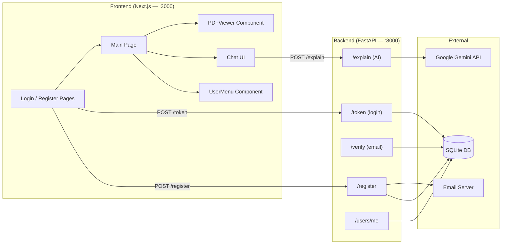

# AI Reading Companion — Project Overview

## What is it?

A **full-stack web app** that lets users read a PDF document and ask an AI questions about what they're reading — all in the same browser window. The AI (Google Gemini 2.5 Flash) uses the **text content of the current PDF page** as context when answering, so answers are grounded in the document.

---

## Architecture

```
ai-reading-companion/
├── backend/      ← Python · FastAPI · SQLite
└── frontend/     ← Next.js 14 · React 18 · Tailwind CSS
```



---

## Backend (FastAPI)

**Entry point:** `backend/main.py` · runs on `http://127.0.0.1:8000`

### API Routes

| Method | Route | Description |
|--------|-------|-------------|
| `GET` | `/` | Health check — confirms server is online |
| `POST` | `/register` | Create a new user + send verification email |
| `POST` | `/token` | Login — returns a JWT access token |
| `GET` | `/verify?token=…` | Email verification via JWT link |
| `POST` | `/explain` | Send a question + PDF page context → Gemini → answer |
| `GET` | `/users/me` | Return current authenticated user's profile |

### Key Modules

| File | Role |
|------|------|
| `main.py` | App entry point, all API routes, CORS config |
| `models.py` | SQLModel data models (`User`, `UserCreate`, `UserRead`) |
| `database.py` | SQLite engine + session factory |
| `auth.py` | Password hashing (bcrypt), JWT creation & verification |
| `emails.py` | Email verification via `fastapi-mail` |

### Database — SQLite (`database.db`)

**`User` table**

| Column | Type | Notes |
|--------|------|-------|
| `id` | int (PK) | Auto-increment |
| `username` | str | Unique, indexed |
| `email` | str | Unique, indexed |
| `hashed_password` | str | bcrypt hash |
| `is_verified` | bool | Default `False` — must verify email to login |

### Authentication Flow

```
Register → bcrypt hash password → save user → send email with 24hr JWT link
                                                      ↓
                                          User clicks /verify → is_verified = True
                                                      ↓
                                          Login → check password + is_verified → 30min JWT
                                                      ↓
                                          Protected routes → Bearer token in Authorization header
```

### Dependencies

- **FastAPI** — web framework
- **SQLModel** — ORM (SQLAlchemy + Pydantic)
- **passlib[bcrypt]** — password hashing
- **python-jose** — JWT encoding/decoding
- **fastapi-mail** — email sending
- **google-genai** — Gemini AI client
- **python-dotenv** — secrets from `.env`

---

## Frontend (Next.js 14)

**Runs on:** `http://localhost:3000`

### Pages & Routes

| Route | File | Purpose |
|-------|------|---------|
| `/` | `src/app/page.js` | **Main app** — PDF viewer + AI chat |
| `/login` | `src/app/login/page.js` | Login form |
| `/register` | `src/app/register/page.js` | Registration form |
| `/profile` | *(referenced, not yet built)* | User profile page |

### Components

| Component | File | Purpose |
|-----------|------|---------|
| `PDFViewer` | `components/PDFViewer.js` | Renders PDF pages, extracts page text, zoom/nav controls |
| `UserMenu` | `components/UserMenu.js` | Dropdown with profile/logout buttons |
| `Popup` | `components/Popup.js` | Reusable toast notification (error/success/warning/info) |

### API Helper (`lib/api.js`)

Centralizes all HTTP calls to the backend:

| Function | Backend Route | Description |
|----------|--------------|-------------|
| `askAI(question, context)` | `POST /explain` | Sends question + page text to AI |
| `login_user(username, password)` | `POST /token` | Logs in, gets JWT |
| `register_user(username, email, password)` | `POST /register` | Creates account |
| `fetch_current_user()` | `GET /users/me` | Gets logged-in user data |

### Key Frontend Features

- **PDF Rendering** — Uses `react-pdf` + `pdfjs-dist` to render PDFs page-by-page
- **Page Text Extraction** — `onPageLoadSuccess` extracts raw text from every PDF page using `getTextContent()`
- **AI Chat** — Sends page text as context with every question; answers stream back with a **typewriter animation**
- **Stop Button** — User can halt the typewriter mid-stream (`stopTypingRef` acting as an "emergency brake")
- **Smart Scroll** — Only auto-scrolls the chat to the bottom if the user is already near the bottom
- **Auth Guard** — Main page redirects to `/login` if no JWT found in `localStorage`
- **Token Storage** — JWT stored in `localStorage` as `"access_token"`

### Dependencies

- **Next.js 14** — React framework with App Router
- **react-pdf / pdfjs-dist** — PDF rendering engine
- **lucide-react** — Icon library
- **Tailwind CSS v4** — Utility-first CSS

---

## Data Flow: Asking a Question

```
1. User opens app → auth check → redirect to login if no token
2. PDF loads → user navigates to a page
3. PDFViewer extracts page text → passes it up to Home via onPageChange callback
4. User types a question → clicks Send
5. Frontend: POST /explain { question, context: pageText } with Bearer token
6. Backend: Gemini API call with a tutor prompt → returns explanation
7. Frontend: renders answer with typewriter animation
```

---

## Environment Variables (`.env` in `/backend`)

| Variable | Purpose |
|----------|---------|
| `GOOGLE_API_KEY` | Gemini AI API key |
| `SECRET_KEY` | JWT signing secret |
| `ALGORITHM` | JWT algorithm (HS256) |
| `MAIL_USERNAME` | SMTP username |
| `MAIL_PASSWORD` | SMTP password |
| `MAIL_FROM` | Sender email address |
| `MAIL_PORT` | SMTP port (default 587) |
| `MAIL_SERVER` | SMTP server hostname |
| `MAIL_SUPPRESS_SEND` | Set `True` in dev to print emails to console instead of sending |

---

## Running the Project

```bash
# Backend (from /backend, with .venv active)
uvicorn main:app --reload

# Frontend (from /frontend)
npm run dev
```

- Backend: http://127.0.0.1:8000
- Frontend: http://localhost:3000
- API Docs (auto-generated): http://127.0.0.1:8000/docs

---

## Known Gaps / Next Steps

> [!NOTE]
> These are features referenced in the code but not yet fully implemented.

- **`/profile` page** — `UserMenu.js` links to it, but the page doesn't exist yet
- **PDF file upload** — Currently the PDF is hardcoded to `/public/sample.pdf`; no upload UI exists
- **Chat history persistence** — History only lives in React state; refreshing clears it
- **Token refresh** — JWT expires after 30 minutes with no refresh mechanism
- **`/explain` auth guard** — The `/explain` route accepts a Bearer token but doesn't currently validate it (no `Depends(get_current_user)`)
